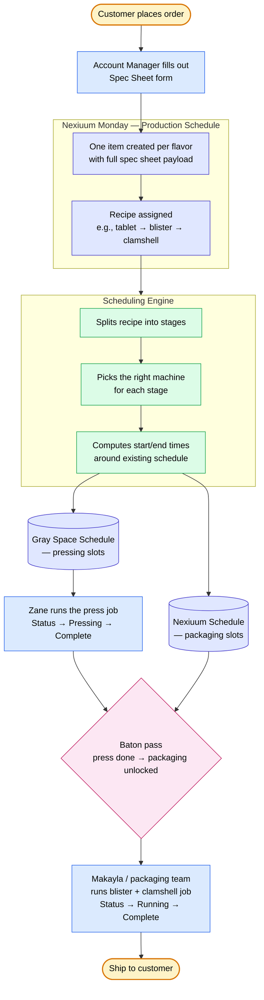
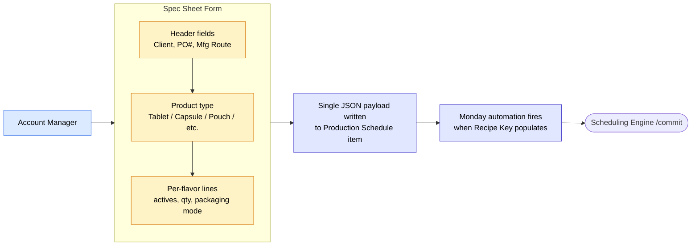
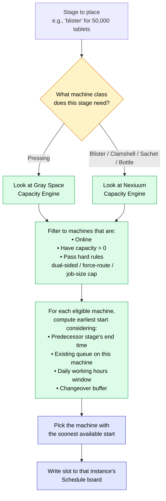
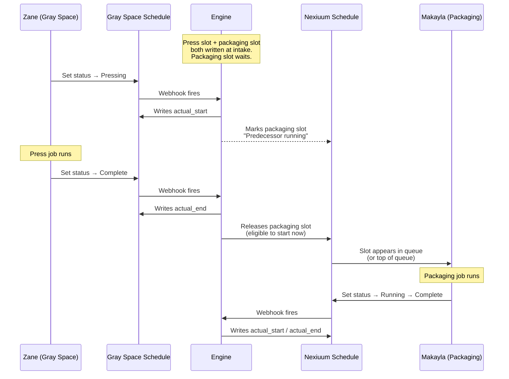
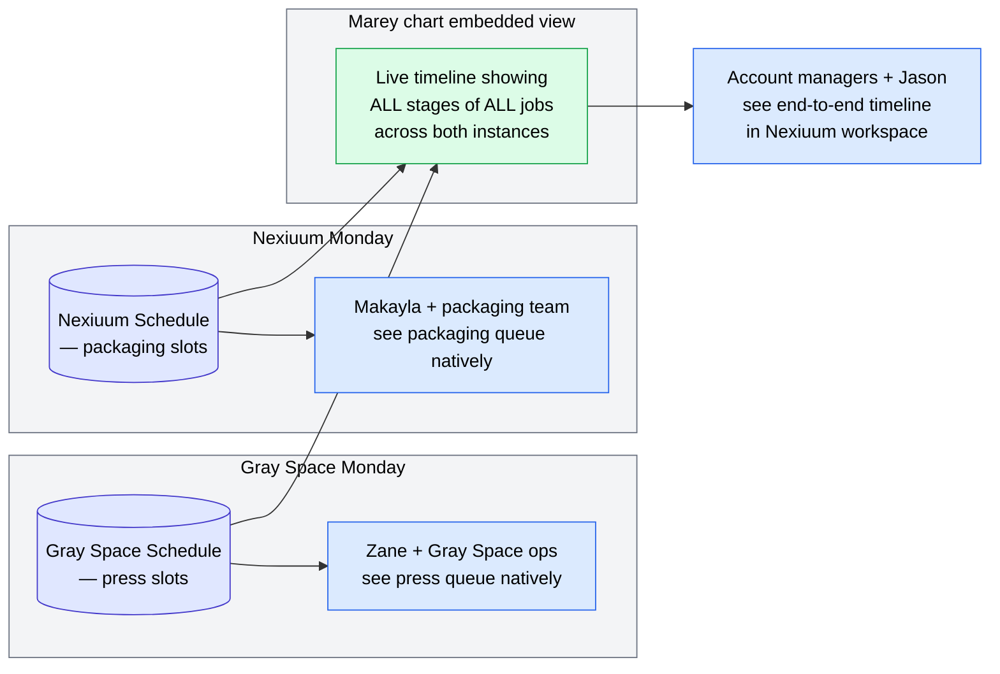
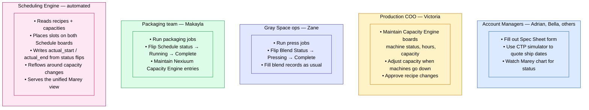
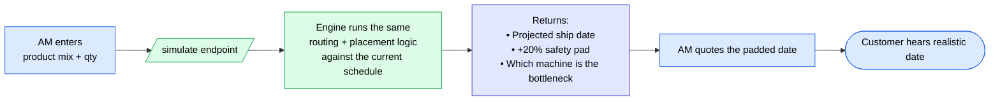

# Nexiuum / Gray Space Scheduling — Process Flowchart

A walk-through of how a customer order moves through the system from intake to shipment. Designed to share with Jason, Victoria, Adrian, Makayla, and the team.

---

## 1. End-to-end flow

---

## 2. What the Spec Sheet form captures (zoom-in)

**Manufacturing Route field** drives what the engine schedules:

| Route | What happens |
|---|---|
| Manufacturing | Press only (Gray Space) |
| Manufacturing + Packaging | Press → packaging DAG (Gray Space → Nexiuum) |
| Packaging | Packaging only (Nexiuum) — tablets already on hand |
| Ship Bulk | Press only, then ship bulk product |
| Keep for Packaging | Press now, package later |
| Hot Shot / Samples | TBD with Makayla |

---

## 3. How the engine picks a machine (zoom-in)

**Hard routing rules** are non-negotiable physical constraints on the machines:

| Rule | Example |
|---|---|
| Dual-sided only | Penn & Teller — only runs dual-sided tablets |
| Force-route by condition | Lancelot — anything with active > 80mg |
| Max job size | Copperfield — 10,000 tabs max (R&D line) |

**Soft routing** for the rest: round-robin by least-recently-used machine, so wear levels out.

---

## 4. The baton pass — press → packaging

The engine reads the Process Recipe to know which stages depend on which. When the press stage finishes, the engine looks up every later stage in that recipe and unlocks them. No manual hand-off needed.

---

## 5. Two Schedule boards, one unified view

**Why two boards instead of one:**
- Each operator team sees their own schedule natively in their workspace
- Cross-account linking in Monday is fragile (admin permissions can revoke)
- The embedded Marey view stitches both together so AMs and leadership get the unified picture

---

## 6. Who does what — role responsibilities

---

## 7. CTP — quote a realistic ship date before committing

When an AM is talking to a customer and needs to know "when can you get me 500k tablets?":

No writes happen — `/simulate` is read-only. It just tells the AM what the schedule would say if this order landed now.

---

## Where we are today (May 2026)

| Piece | Status |
|---|---|
| Gray Space pressing engine | Live on bb-infra-01, production-verified |
| Gray Space Capacity Engine board | Live, 7 machines |
| Nexiuum Capacity Engine board | Built, 22 packaging machines, ~13 awaiting Makayla's capacity numbers |
| Cross-instance scheduling | Built and tested locally, not yet deployed |
| Spec Sheet form | Adrian is building it |
| Baton pass (press → packaging) | Designed, next on the build list |
| Marey chart (Gray Space only) | Live |
| Marey chart (multi-instance) | Pending |
| Live production verify | After all of the above land |

---

*Generated 2026-05-25. Update when the build state changes.*
